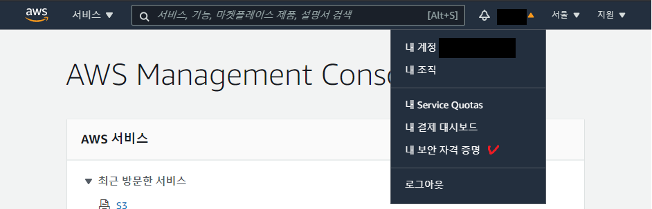
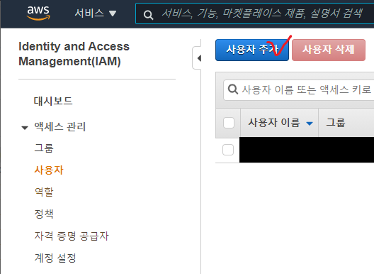
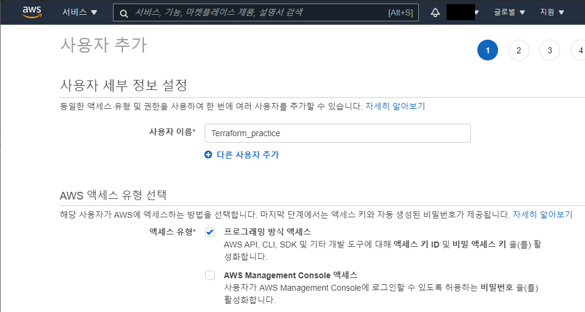
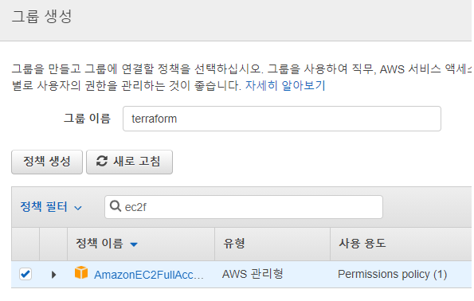
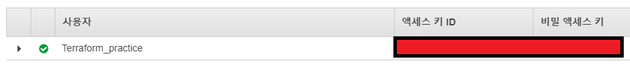

# Terraform
테라폼은 하시코프에서 클라우드 인프라스트럭처 자동화를 지향하는 [IaC(Infrastructure as Code)](#IaC) 도구이다. AWS, Azure, GCP 같은 클라우드 뿐만 아니라 더 많은 서비스들도 지원한다.

# 작업 흐름
1. Scope - 프로젝트를 위해 만들어야 할 리소스가 무엇인지 확인한다.
2. Author - 파일 작성 (Create the configuration file in HCL)
3. Initialize - ```terraform init```으로 프로젝트에 필요한 플러그인을 다운로드 한다.
4. Plan & Apply - ```terraform plan```으로 과정을 검증하고 ```terraform apply```로 클라우드에 적용한다.
5. Destroy - 리소스 제거

> plan을 통해서 꼭! 검증하고 apply를 해야 실제 배포시 일어나는 문제점을 최대한 줄일 수 있다고 합니다. 잊지말고 apply!!

## IaC
Infrastructure as Code의 줄임말로 코드를 통해 인프라 구성요소들을 구축하고 관리하는 것을 뜻한다.
IaC는 코드의 장점인 작성용이성, 재사용성, 유지보수 등의 장점을 가진다.

# AWS와 연결
## 테라폼으로 AWS VPC를 만드는 대략적 과정
1. AWS에서 IAM 액세스 키 발급하기
2. 테라폼 설치
3. 리소스 정의
4. 선언한 리소스들 확인(Plan)
5. 적용(Apply)
  
## 1. AWS에서 IAM 액세스 키 발급하기
1. aws에 로그인을 한 후 '내 보안 자격 증명'을 클릭해 들어갑니다.

2. 좌측에 있는 액세스 관리 > 사용자를 들어가 사용자 추가를 해줍니다.

3. 사용자 이름은 자유롭게, AWS 엑세스 유형 선택은 프로그래밍 방식 엑세스를 선택해줍니다.
> AWS Management Console 엑세스는 웹에서 접속을 하게 해줍니다. terraform은 웹에서 사용하는 것이 아니기 때문에 필요 없습니다.

4. 권한 설정을 해줍니다.
> 현재는 vpc - ec2 구축이 목적이고 IAM에 대해 공부하는 것이 아니기 때문에 ec2fullaccess와 vpcfullaccess를 해줍니다.
그룹에 사용자 추가 > 그룹 생성 > 그룹 이름 입력, ec2fullaccess, vpcfullaccess 선택


5. 생성된 사용자의 액세스 키 ID와 비밀 엑세스 키를 기억해둡니다.
**유출될 경우 다른 누군가가 여러분의 계정에 침투하여 수많은 비용을 야기시킬수 있습니다.**



## 2. 테라폼 설치
> Ubuntu 18.04 LTS를 기준으로 합니다.
1. 압축 해제 설치.
```
sudo apt-get install unzip
```
2. [Terraform](https://www.terraform.io/downloads.html) 홈페이지에서 최신 버전을 확인하고 다운로드 링크를 복사합니다
3. Terraform 다운로드
```
wget https://releases.hashicorp.com/terraform/0.14.3/terraform_0.14.3_linux_amd64.zip
```
4. 압축풀기
```
unzip terraform_0.14.3_linux_amd64.zip
```
5. bin으로 파일 이동
```
sudo mv terraform /usr/local/bin
```
6. 설치 확인 (버전 확인)
```
terraform --version
```

## 3. 리소스 정의
> aws 서비스 기준으로 묶었습니다. 다음과 같은 순서로 정의합니다.(달라도 문제는 없습니다. 의존관계는 테라폼에서 알아서 이해합니다. ~~테라폼 짱!~~)
- aws.tf (access_key, key_pair)
- vpc.tf
- security-group.tf
- aws-ec2.tf

### aws.tf

```HCL
provider "aws" {
  access_key = "your_access_key"
  secret_key = "your_secret_key"
  region     = "ap-northeast-2" // ap-northeast-2 -> south korea
}

resource "aws_key_pair" "deployer" {
  key_name = "deployer-key"
  public_key = file("~/.ssh/web_admin.pub")
}
```
provider를 aws로 잡고 접근을 위한 access_key, secret_key, 위치를 입력합니다.
access_key와 secret_key는 IAM에서 발급한 키 값을 입력합니다.
public_key는 [이쪽](https://blog.outsider.ne.kr/1260)을 참고하시면 됩니다.

ec2와 통신하기 위한 키 페어도 입력합니다.
주석은 //, #가 single line이고 /**/가 multi line 입니다. 엄밀히 말하면 //보단 #를 쓰는 것이 추천됩니다. 자세한건 [이쪽](https://www.terraform.io/docs/configuration/syntax.html#comments)을 보시면 이해하실 겁니다.
### provider? resource? 이게 뭐지?
provider은 테라폼과 외부 서비스를 연결해주는 기능을 해줍니다. `provider "aws"`로 어떤 서비스를 사용하는지 정의하고 `{}`안에 필요한 정보를 입력합니다.

resource는 특정 프로바이더에 대한 조작 가능한 대상의 최소 단위입니다. aws 프로바이더의 resource로 여기선 aws_key_pair를 사용하고 있습니다.
```
resource(예약어) "resource 타입" "resource 이름" {구현}
```
다음과 같은 형식을 가집니다.

### vpc.tf

```HCL
resource "aws_vpc" "example" {
  cidr_block = "172.10.0.0/20"
  tags = {
    Name = "example"
  }
}

# az = ap-northeast-2a -> seoul region a
resource "aws_subnet" "example-a" {
  vpc_id = "${aws_vpc.example.id}"
  cidr_block = "172.10.0.0/24"
  availability_zone = "ap-northeast-2a"
}

# az = ap-northeast-2c -> seoul region c
resource "aws_subnet" "example-c" {
  vpc_id = "${aws_vpc.example.id}"
  cidr_block = "172.10.1.0/24"
  availability_zone = "ap-northeast-2c"
}
```
VPC와 서울 AZ에서 a와 c를 subnet으로 사용하는 코드입니다.
### VPC?
VPC는 Virtual Private Cloud의 약자입니다. AWS, Azure같은 public cloud에서 private한 cloud 영역을 가진다고 생각하시면 됩니다. 혹시 EC2를 생성해보신 적이 있나요? 사실 그 EC2도 기본 VPC가 정의되어 있고 이 기본 VPC 안에서 가동이 되는 것 입니다.

### 왜 서브넷을 2개나?
하나만 만들어도 당연히 EC2 인스턴스를 사용할 수 있습니다. 하지만 AWS에서는 다중 AZ라는 기능을 제공합니다. 두 AZ간 유사한 리소스를 각각 두어서 사용하는데 한쪽이 서비스 장애가 일어났을 때 빠르게 다른 한쪽이 서비스를 이어받아 장애로 인한 서비스 중단을 예방할 수 있는 장점이 있습니다.

### security-group.tf
```HCL
resource "aws_security_group" "example-allow-all" {
  name = "example-allow_all"
  description = "Allow all inbound tracffic"
  vpc_id = "${aws_vpc.example.id}"

 ingress {
  from_port = 0
  to_port = 0
  protocol = "-1" # allow all protocol
  cidr_blocks = ["0.0.0.0/0"]
  }

 egress {
  from_port = 0
  to_port = 0
  protocol = "-1"
  cidr_blocks = ["0.0.0.0/0"]
 }
}
```
security group을 생성하는 코드입니다. ingress는 인바운드, egress는 아웃바운드를 의미합니다. 

### aws-ec2.tf
```HCL
# variable = input
variable "key_pair" {
  default = "deployer-key"
}

data "aws_ami" "ubuntu" {
  most_recent = true
  filter {
    name = "name"
    values = ["ubuntu/images/hvm-ssd/ubuntu-xenial-16.04-amd64-server-*"]
  }
  filter {
    name = "virtualization-type"
    values = ["hvm"]
  }
  owners = ["099720109477"]
}

resource "aws_instance" "example-server-1" {
  ami = "${data.aws_ami.ubuntu.id}"
  instance_type = "t2.micro"
  subnet_id = "${aws_subnet.example-a.id}"
  vpc_security_group_ids = ["${aws_security_group.example-allow-all.id}"]
  key_name = "${var.key_pair}"
  count = 1
  tags = {
    Name = "example_ec2-a"
  }
}

resource "aws_instance" "example-server-2" {
  ami = "${data.aws_ami.ubuntu.id}"
  instance_type = "t2.micro"
  subnet_id = "${aws_subnet.example-c.id}"
  vpc_security_group_ids = ["${aws_security_group.example-allow-all.id}"]
  key_name = "${var.key_pair}"
  count = 1
  tags = {
    Name = "example_ec2-c"
  }
}
```
### variable? data?
variable은 input으로 생각하시면 됩니다. `예약어 "이름" {구현}`형식을 따릅니다.

data는 terraform이 주어진 data source (여기선 `aws_ami`와 `aws_instance`)를 읽고 그에 따른 결과를 지역 이름 (`example-server-1`,`example-server-2`)에 넘겨주는 역할을 합니다. [여기](https://www.terraform.io/docs/configuration/data-sources.html#using-data-sources)를 읽어보시길 추천드립니다.

`aws_ami`에서 설치할 우분투 버전을 고르고 `aws_instance`를 통해 두곳의 AZ에 각각 하나의 ec2 인스턴스를 설정하는 코드입니다.

# 출처 / 참고
- [Introduction to Infrastructure as Code with Terraform - Workflows](https://learn.hashicorp.com/tutorials/terraform/infrastructure-as-code?in=terraform/aws-get-started#workflows)
- [how-to-install-terraform-in-ubuntu](https://qastack.kr/ubuntu/983351/how-to-install-terraform-in-ubuntu)
- [Terraform으로 AWS 관리하기](https://blog.outsider.ne.kr/1260)
- [만들면서 배우는 아마존 버추얼 프라이빗 클라우드(Amazon VPC)](https://www.44bits.io/ko/post/understanding_aws_vpc)
- [테라폼(Terraform) 기초 튜토리얼 - AWS와 테라폼으로 구현하는 Infrastructure as Code](https://www.44bits.io/ko/post/terraform_introduction_infrastrucute_as_code)
