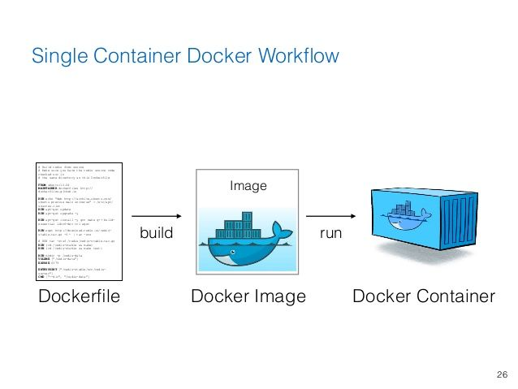

# Docker
도커는 컨테이너 기반의 오픈소스 가상화 플랫폼이다. 여러 컨테이너가 호스트 OS의 자원을 공유하여 사용한다.

## 컨테이너?
컨테이너란 호스트 OS의 자원을 논리적으로 분리한 구역(프로세스)을 뜻함. 호스트 OS의 환경에 구애받지 않고 실행할 수 있는 장점을 가지고 있다.

## 그럼 VM과의 차이는?
VM(Virtual Machine)은 한 가상화에 OS가 포함되고 가상화끼리 호스트 OS의 자원을 공유하지 않고 분리해서 사용하나, 도커는 컨테이너간 호스트 OS의 자원을 공유하여 사용하기 때문에 가상화에 비해 성능에 큰 우위를 점한다.

VM(Virtual Machine) | Container
:----------:|:----------:
|

<!--
# 컨테이너라는 특징에서 사용해야 할 이유가 더 있다
컨테이너는 Docker 위에서 작동한다. 컨테이너화 된 프로그램들은 컨테이너의 장점에 의해 OS에 구애받지 않고 똑같이 작동한다. 그러므로 다른 OS라도 같은 실행을 보장할 수 있는 것이다. 조금씩 버전과 설정이 다른 다수의 서버에 똑같은 환경을 구현할 때 Docker를 사용하면 보장될 수 있는 것이다.
 -->
 
# 작업흐름(Workflow, 작성에서 베포까지)

1. Dockerfile 작성
2. Docker Image 빌드
3. Docker Container 작동

> [Microsoft에서 제공하는 workflow](https://docs.microsoft.com/ko-kr/dotnet/architecture/microservices/docker-application-development-process/docker-app-development-workflow)가 더 구체적이지만 입문 기준으로는 저 3가지 핵심만 봐도 충분하다 생각합니다.

# 작업흐름에 따른 Docker Container 만들어보기
> 우분투 기준입니다. Docker 설치는 [이쪽](https://www.44bits.io/ko/post/easy-deploy-with-docker)을 참고하시면 됩니다.

## Dockerfile 작성
```dockerfile
FROM ubuntu:bionic # FROM
RUN apt-get update # RUN : 명령어를 실행해라
RUN apt-get install -y git
```
1. `FROM ubuntu:bionic` : bionic 버전 ubuntu image로부터 image layer를 시작하겠다.
2. `RUN apt-get update` : apt-get update라는 명령을 실행해라.
3. `apt-get install -y git` : git을 설치하라는 명령을 실행해라.

## Docker Image 빌드
```
sudo docker build -t ubuntu:git-from-dockerfile .
```
직역 : docker로 build하는데 -t = 이름을 설정한다, ubuntu:git-from-dockerfile로, .(=현재 경로의 Dockerfile 기준으로)

현재 경로의 Dockerfile을 읽어서 git-from-dockerfile버전의 ubuntu 이미지를 빌드한다는 의미.

```
Step 1/3 : FROM ubuntu:latest
latest: Pulling from library/ubuntu
da7391352a9b: Pull complete 
14428a6d4bcd: Pull complete 
2c2d948710f2: Pull complete
Step 2/3 : RUN apt-get update
 ---> Running in 9e14afdb6878
Step 3/3 : RUN apt-get install -y git
...
 ---> 0ca5b5553167
Successfully built 0ca5b5553167
Successfully tagged ubuntu:git-from-dockerfile
```
작성한 순서대로 작동하는 것을 확인할 수 있다. 생성한 이미지에서 깃이 잘 설치된 것을 확인할 수 있다. git이 기본 설치된 ubuntu 이미지를 빌드한 것이다.

## Docker Container 작동해보기
```
$ sudo docker run -it ubuntu:git-from-dockerfile bash
root@07b830ee9cd5:/# git --version
git version 2.25.1
```
> -it는 -i 옵션과 -t의 옵션이 합쳐진건데 [이쪽](http://pyrasis.com/book/DockerForTheReallyImpatient/Chapter20/28) 에서 확인하시면 됩니다.

### Docker Container 확인
```
$ sudo docker container ls -a
CONTAINER ID   IMAGE                        COMMAND                  CREATED          STATUS                       PORTS     NAMES
07b830ee9cd5   ubuntu:git-from-dockerfile   "/bin/bash"              12 seconds ago   Exited (0) 11 seconds ago              sleepy_curran
```
대략 이런 형식으로 나온다.

# Docker Image와 Container 정리
Docker Image는 Dockerfile을 통해 만들어지는데, 만든 이미지는 변경불가(Immutable, Read Only)한 특성을 가지고 있다. 

Container는 Docker Image위에서 작동하는 프로세스로 변경 가능(mutable, writable)하다.


## 왜 변경불가한가? 가능한게 좋은게 아닌가? (변경 불가의 장점)
여러 서버에 같은 os, 프로그램을 설치해도 업데이트와 패치차이가 생긴다면 이후 어떤 프로그램, 코드를 실행했을 때 같은 결과를 보장할 수 없다.

Docker Image는 변경 불가하므로 같은 버전을 다중 서버에 적용할 수 있다.(= 변경점이 생기면 변경 불가의 특성으로인해 새로운 버전의 이미지를 생성하고 적용하여 모든 서버의 동일한 상태를 보장한다.)


<!-- 더 작성할 내용
*docker image 베포하기*
-->
## 참고
- [Docker - 컨테이너란? (Container)](https://captcha.tistory.com/46)
- [[Docker] 개념 정리 및 사용방법까지.](https://cultivo-hy.github.io/docker/image/usage/2019/03/14/Docker%EC%A0%95%EB%A6%AC/)
- [왜 굳이 도커(컨테이너)를 써야 하나요?](https://www.44bits.io/ko/post/why-should-i-use-docker-container)
- [[Container 시리즈] 00. Container/ Docker란 뭔가요?](https://tech.osci.kr/2020/03/03/91690167/)
-[도커(Docker) 입문편 - 컨테이너 기초부터 서버 배포까지](https://www.44bits.io/ko/post/easy-deploy-with-docker)
- [Using Docker Containers to Improve Reproducibility in Software and Web Engineering](https://www2.slideshare.net/vincenzoferme/using-docker-containers-to-improve-reproducibility-in-software-and-web-engineering/37)
- [Docker 앱에 대한 개발 워크플로](https://docs.microsoft.com/ko-kr/dotnet/architecture/microservices/docker-application-development-process/docker-app-development-workflow)
- [가장 빨리 만나는 Docker 20장 - 2. build](http://pyrasis.com/book/DockerForTheReallyImpatient/Chapter20/02)
- [About storage drivers](https://docs.docker.com/storage/storagedriver/)
- [클라우드에서는 서버를 한번 쓰고 버린다고? – Immutable infrastructure & Docker](http://www.opennaru.com/openshift/immutable-infrastructure-vs-old-infra/)